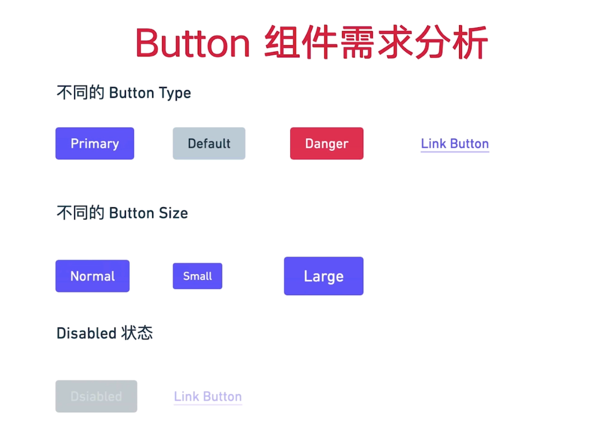
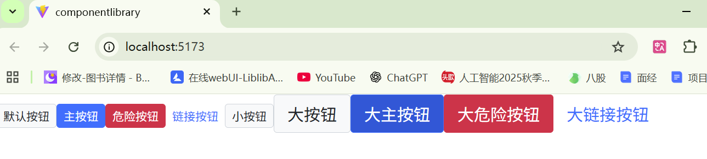
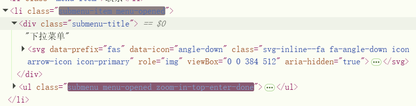
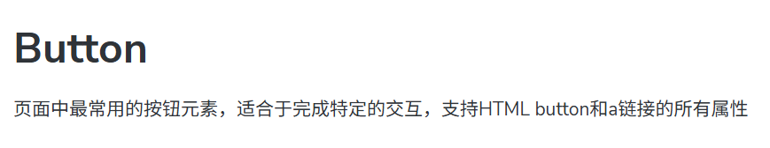
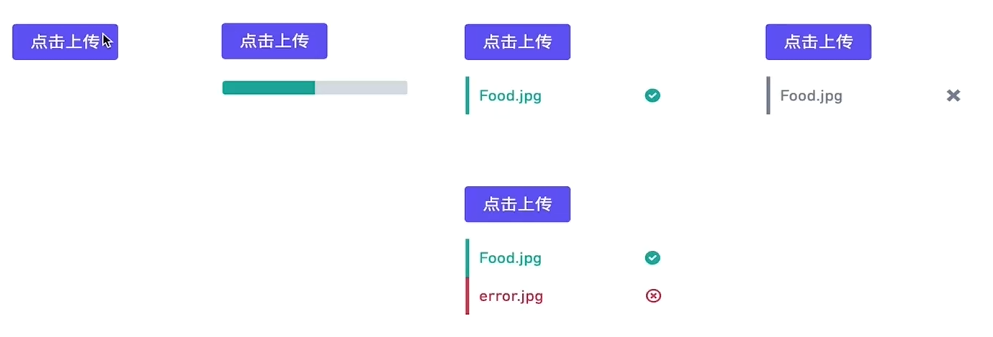
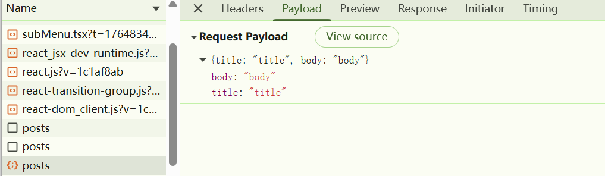
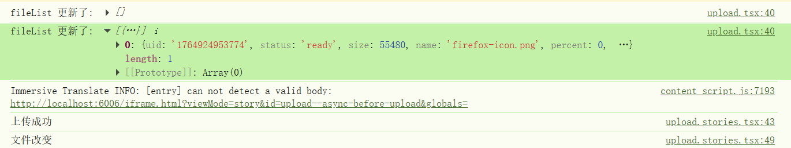
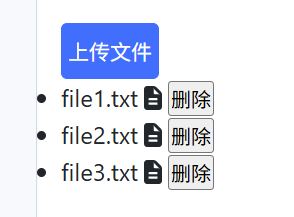
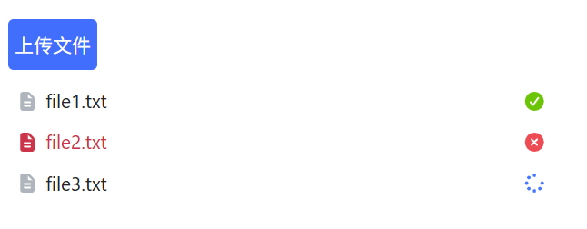
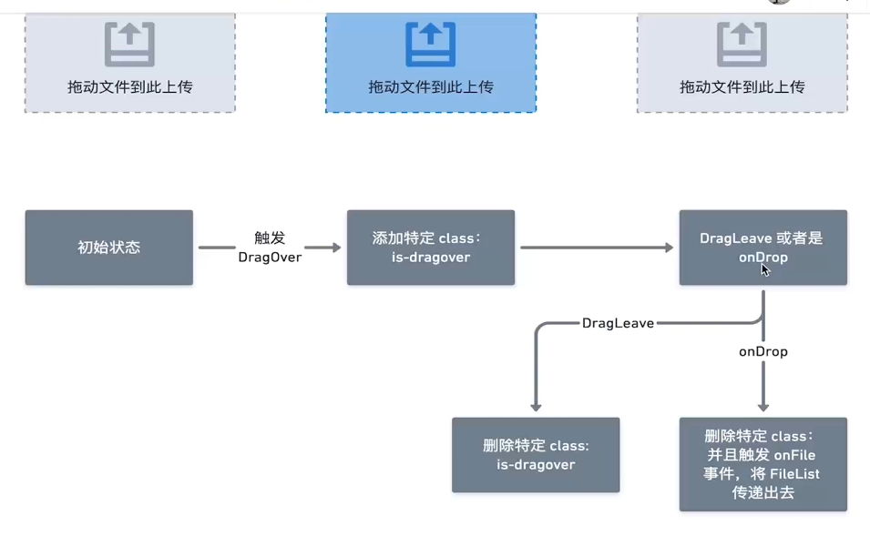

# React + TypeScript + Vite

## CSS

Sass 是 CSS 的增强版：

- 可以用 **变量**：方便统一管理颜色、字体、间距等
- 可以用 **嵌套**：CSS 层级关系更清晰
- 可以用 **mixin 和函数**：复用样式或做计算
- 支持 **模块化**：通过 `@use` 或 `@import` 分文件管理样式


1️⃣ `_reboot.scss`

- 作用：重置或统一浏览器默认样式
- 解释：不同浏览器对 HTML 元素有默认样式（比如 `h1`、`p`、`button`），会导致界面显示不一致
- `_reboot.scss` 会把这些默认样式统一
- `_` 前缀说明：这是一个 **局部文件，不直接编译成 CSS**，只被其他 `.scss` 文件导入使用

2️⃣ `_variables.scss`

- 作用：定义全局样式变量
- 解释：为了方便管理颜色、字体、间距等样式，可以把它们放在变量里
- 例子：

3️⃣ `index.scss`

- 作用：汇总、引入所有子样式，并最终被项目引用
- 解释：就像一个“总入口”，把 `_reboot.scss`、`_variables.scss` 等文件整合起来

## 第一个组件Button



最终实现



### 安装class Names

根据条件自动拼 class Name

```js
npm install classnames
```

用法：根据你给按钮的配置，决定要加哪些 CSS 类名

```js
classNames(
  固定class,
  可选class,
  {
    "class-名字": 条件,
    "class-名字": 条件
  }
)
```

条件为 **true** → 加这个 class
条件为 **false** → 不加

最终效果：

```js
<button class="btn btn-primary btn-lg disabled"></button>
```

### React Button 组件整体流程总结

1️⃣ 明确需求和功能

先想清楚按钮要实现什么功能：

- 可以有不同类型（primary / default / danger / link）
- 可以有不同尺寸（lg / sm）
- 可以禁用（disabled）
- 可以是普通按钮 `<button>` 或链接 `<a>`
- 可以自定义样式（className）
- 支持子内容（children）

------

2️⃣ 定义类型（TypeScript）

用 TS 规定组件的 Props 类型，保证传参安全：

```js
export type ButtonSize = 'lg' | 'sm'
export type ButtonType = 'primary' | 'default' | 'danger' | 'link'

interface BaseButtonProps {
  className?: string
  disabled?: boolean
  size?: ButtonSize
  btnType?: ButtonType
  children: React.ReactNode
  href?: string
}
```

- **children** → 按钮内容
- **btnType** → 按钮类型
- **size** → 按钮大小
- **disabled** → 是否禁用
- **href** → 链接按钮地址
- **className** → 用户自定义样式

------

3️⃣ 拼 className 样式

用 `classnames` 根据条件拼接 class：

```js
const classes = classNames('btn', className, {
  [`btn-${btnType}`]: btnType,
  [`btn-${size}`]: size,
  'disabled': btnType === 'link' && disabled
})
```

- `btn` → 基础样式
- `btn-${btnType}` → 类型样式
- `btn-${size}` → 尺寸样式
- `disabled` → 链接禁用样式
- 支持额外 `className`

------

4️⃣ 判断渲染哪种 HTML 标签+设置默认值

```js
if (btnType === 'link' && href) {
  // 链接按钮
  return <a className={classes} href={href} {...restProps}>{children}</a>
} else {
  // 普通按钮
  return <button className={classes} disabled={disabled} {...restProps}>{children}</button>
}
```

- **`<a>`** → btnType=link + href
- **`<button>`** → 其他情况
- `{...restProps}` → 支持额外属性（onClick、target 等）

测试发现这样定义会失效，所以直接传入默认值

```js
/*// 给 props 设置默认值
// 当用户使用组件时，没有传某个 prop，就用这里设置的默认值
Button.defaultProps = {
  btnType: 'default',
  size: 'sm',
  disabled: false,
}*/

//对BaseButtonProps解构props
export const Button = ({
  btnType='default',
  className,
  disabled=false,
  size='sm',
  children,
  href,
  ...restProps
}: ButtonProps) => {
```

5️⃣ 完整组件框架

```js
import React from 'react'
import classNames from 'classnames'

export const Button = ({
  btnType='default',
  className,
  disabled=false,
  size='sm',
  children,
  href,
  ...restProps
}: BaseButtonProps) => {
  const classes = classNames('btn', className, {
    [`btn-${btnType}`]: btnType,
    [`btn-${size}`]: size,
    'disabled': btnType === 'link' && disabled
  })

  if (btnType === 'link' && href) {
    return (
      <a className={classes} href={href} {...restProps}>
        {children}
      </a>
    )
  } else {
    return (
      <button className={classes} disabled={disabled} {...restProps}>
        {children}
      </button>
    )
  }
}

// 给 props 设置默认值
// 当用户使用组件时，没有传某个 prop，就用这里设置的默认值
Button.defaultProps = {
  btnType: 'default',
  size: 'sm',
  disabled: false,
}

export default Button
```

------

6️⃣ 使用方法示例

```js
<Button>默认按钮</Button>
<Button btnType="primary">主按钮</Button>
<Button btnType="danger" size="lg">大红按钮</Button>
<Button btnType="link" href="https://example.com">链接按钮</Button>
<Button btnType="link" href="https://example.com" disabled>禁用链接</Button>
```

------

7️⃣ 总结流程思路

1. **分析功能需求** → 类型、状态、特殊情况
2. **定义 TS 类型** → 保证 props 安全
3. **拼接 className** → 模块化、条件化样式
4. **判断渲染标签** → `<button>` 或 `<a>`
5. **透传剩余 props** → 支持 onClick、target 等
6. **返回 JSX** → 子内容(children) 渲染
7. **在项目里使用** → 根据 props 控制样式和行为

### 继承原生属性

方法一：联合类型（Union Type）

```
type ButtonProps = ButtonHTMLProps | AnchorHTMLProps;
```

- 解释：这个 ButtonProps **可能是按钮属性，也可能是链接属性**
- 缺点：访问属性时 TypeScript 可能不确定类型，需要做类型判断

------

方法二：交叉类型（Intersection Type） —— 更常用

```
type ButtonProps = CustomProps & Partial<ButtonHTMLProps & AnchorHTMLProps>;
```

- `&` 表示 **交叉类型**（Intersection）
- 意思：ButtonProps **同时包含**：
  - 自定义属性（btnType、size、href 等）
  - 原生按钮属性
  - 原生链接属性（用 Partial 包裹表示可选）
- 优点：使用 `...restProps` 时，TS 能智能提示所有属性，不需要额外判断

> 总结：
>
> - 联合类型（`|`） = 多种可能，某一时刻只能是其中一种
> - 交叉类型（`&`） = 多种类型叠加，同时拥有
> - 组件里用交叉类型更合适，因为我们希望自定义属性和原生属性 **都能用**

`Partial<T>` 是 TypeScript 的一个 **工具类型（Utility Type）**，作用是：

> 把类型 `T` 里的 **所有属性都变为可选（optional）**

交叉类型，包含 `<button>` 和 `<a>` 的所有原生属性

如果不加 `Partial`：

- 会报错，因为交叉类型里所有原生属性都是必填
- 加 `Partial` 后，原生属性 **都变为可选**，你只传 `onClick` 或 `type` 就可以了

## 测试

安装vitest

```js
npm install -D vitest
```

```js
//package.json
{
  "scripts": {
    "test": "vitest"
  }
}
```

安装testing-library

```js
npm install --save-dev @testing-library/react @testing-library/jest-dom jsdom
```

配置enviroment，这是vite.config.ts

```js
/// <reference types="vitest/config" />
import { defineConfig } from 'vite'
import react from '@vitejs/plugin-react'

// https://vite.dev/config/
export default defineConfig({
  plugins: [react()],
  test: {
    globals: true,          // 可以直接使用 test/expect
    environment: "jsdom",   // 模拟浏览器环境
  }
})
```

安装jest-dom

```js
npm install --save-dev @testing-library/jest-dom
```

## Menu导航组件


分为Menu和MenuItem两个组件

### context

要将Menu的props传入MenuItem，使用hook

 Context

- 是 React 自带的 API（`createContext` + `useContext`）。
- 适合组件树中少量状态共享，例如：菜单的选中项、主题色、语言切换等。
- 状态通常由父组件管理（这里的 `Menu`），然后通过 Context 传给子组件。
- 使用简单，不需要额外依赖。

```js
//context属性种类
interface IMenuContext {
    index: number;
    onSelect: (index: number) => void;
    mode?: MenuMode;
}

//context默认值
export const MenuContext = createContext<IMenuContext>({
    index: 0,
    onSelect: () => { },
    mode: 'horizontal',
})
```

provider中实际传入的值

```js
const passedContext: IMenuContext = {
        index: currentActive,
        onSelect: (index) => {
            setCurrentActive(index)
            onSelect(index)
            alert(index)
        },
        mode,
    }
```

包裹组件

```js
return (
    	//包裹
        <MenuContext.Provider value={passedContext}>
            <ul className={classes} style={style}>
                {children}
            </ul>
        </MenuContext.Provider>
        //包裹
    )
```


### 测试

#### 发现active没有渲染到className中

active为异步渲染

1、你点击 MenuItem：

```
const thirdItem = wrapper.getByText('xyz')
thirdItem.click()
```

2、MenuItem 内部会调用 `onSelect(index)`：

```
const handleClick = () => {
  if (!disabled) onSelect(index)
}
```

3、Menu 组件里 `onSelect` 更新 state：

```
setCurrentActive(index) // React 异步更新
```

4、React state 更新是 **异步的**，下一轮渲染（re-render）才会触发 MenuItem class 更新：

```
const classes = classNames('menu-item', {
  'active': currentActive === index
})
```

- 所以在点击事件之后立即检查 `thirdItem.className`，可能还没更新 → 断言失败

#### `waitFor`

```js
await waitFor(() => {
  expect(wrapper.getByText('xyz')).toHaveClass('active')
})
```

- `waitFor` 会循环执行回调，直到：
  1. 断言通过
  2. 或者超时
- 这样就能等待 **React 异步更新完成**，拿到最新的 DOM class

#### beforeEach cleanup（）

```js
beforeEach(() => {
    // 每个测试用例运行前执行
    wrapper = render(generateMenu(defaultProps))
    //拿到被标记 data-testid="test-menu" 的 DOM 元素(即<ul>)
    menuElement = wrapper.getByTestId('test-menu')
    activeElement = wrapper.getByText('active')
    disabledElement = wrapper.getByText('disabled')
  })
```

```js
test('vertical menu', () => {
    //清除wrapper渲染的defaultProps，里面也有test-menu所以查找到多个
    cleanup()
    const verticalWrapper = render(generateMenu(VerticalProps))
    const verticalMenuElement = verticalWrapper.getByTestId('test-menu')
    expect(verticalMenuElement).toHaveClass('menu-vertical')  // 检查默认类名
  })
```

### renderChildren

1、**统一处理子元素**

在复杂组件里，`children` 可能有各种类型：`MenuItem`、`SubMenu`、甚至其他 React 元素

如果直接 `{children}` 渲染，可能出现非法元素或渲染错误

`renderChildren` 可以：

- 过滤掉不合法的元素
- 给每个合法子元素自动加 `index`、`key` 等属性

2、**方便扩展子菜单**

当你增加 `SubMenu` 或动态生成菜单时，不用修改父组件核心渲染逻辑

可以在 `renderChildren` 里做统一逻辑：

- 添加 context
- 注入 props
- 做类型检查

3、**保证组件健壮性**

防止开发者传入错误的子元素

比如 `<Menu>123</Menu>`，直接渲染就乱了，用 `renderChildren` 可以过滤掉

```js
const renderChildren = () => {
        //React.Children 是 React 提供的一个工具对象，专门用来操作组件的 children 属性
        return React.Children.map(children, (child, index) => {
            //child 是一个 React 元素，它的 props 类型是 MenuItemProps
            const childElement = child as React.ReactElement<MenuItemProps>
            //类型保护，判断childElement.type是否为函数组件
            // type 可能是：
            // HTML 标签（'div'、'ul'） → 没有 displayName
            // React 组件（函数组件、class组件） → 有 displayName
            if (typeof childElement.type === 'function') {
                const type = childElement.type as { displayName?: string }
                const displayName = type.displayName
                if (displayName === 'MenuItem') {
                    return child
                } else {
                    console.error('Menu children must be MenuItem')
                    return null
                }
            } else {
                console.error('Menu children must be function component')
                return null
            }
        })
    }
```

在menuItems中定义了displayName

```js
MenuItem.displayName = 'MenuItem'
```

#### 测试（浏览器中）：

```js
<Menu mode="vertical" defaultIndex={0} onSelect={(index) => console.log(index)}>
        <MenuItem index={0}>首页</MenuItem>
        <MenuItem index={1} disabled>关于</MenuItem>
        <MenuItem index={2}>联系</MenuItem>
        <li>123</li> 
        //输入不合法字符
</Menu>
```


有报错

#### 测试（文件中）：

Vitest 测试：默认console.log被拦截，需要 `spyOn` 才能捕获。

`spy`（间谍）本质上就是“监听一个函数被调用的情况”，你可以检查：

- 函数是否被调用
- 调用次数
- 调用参数

```js
const spy = vi.spyOn(console, 'error')//监听console函数

expect(spy).toHaveBeenCalledWith('Menu children must be function component')
expect(spy).toHaveBeenCalledWith('Menu children must be MenuItem')
//恢复原函数，也就是撤销 spy 的监听
spy.mockRestore()
```

#### 自动添加index

```js
if (displayName === 'MenuItem') {
     //给menuitem自动添加index属性
     const indexProp = childElement.props.index ?? index;
     return React.cloneElement(childElement, { index: indexProp });
}
```

### 添加 **下拉菜单（SubMenu）**

修改样式css--很难

#### 下拉菜单的open

在menu组件的context中传入mode判断是垂直还是水平

```js
//传入context
const { index: currentActive, mode } = useContext(MenuContext)

//处理hover
    let timer: any
    const handleMouse = (e: React.MouseEvent, toggle: boolean) => {
        clearTimeout(timer)
        e.stopPropagation()
        timer = setTimeout(() => {
            setMenuOpen(toggle)
        }, 300)
    }
    //click
    const clickEvents = mode === 'vertical' ? {
        onClick: handleClick,
    } : {}
    //hover
    const mouseEvents = mode !== 'vertical' ? {
        onMouseEnter: (e: React.MouseEvent) => handleMouse(e, true),
        onMouseLeave: (e: React.MouseEvent) => handleMouse(e, false),
    } : {}
```

绑定事件

```js
return (
        <li key={index} className='submenu-item' {...mouseEvents}>
            <div className='submenu-title' {...clickEvents}>
                {title}
            </div>

            <ul className={classes}>
                {renderChildren()}
            </ul>
        </li>
    )
```

#### 区分MenuItem和subMenu中的MenuItem的共有index

将index改成string类型

```js
// 顶层 MenuItem
<MenuItem index="0" />

// SubMenu
<SubMenu index="1" title="子菜单">
    <MenuItem index="1-0" />
    <MenuItem index="1-1" />
</SubMenu>
```

#### 默认展开功能

`defaultOpenSubMenus` 控制初始展开状态

新增menu属性

```js
defaultOpenSubMenus?: string[];
```

通过context传给subMenu

```js
    //排除未定义的defaultOpenSubMenus
    const opendSubMenus=defaultOpenSubMenus as Array<string>
    //如果是垂直菜单，且默认打开的子菜单包含当前子菜单索引，那么就设置为打开状态
    const isOpend = (index&&mode==='vertical') ? opendSubMenus?.includes(index) : false
    const [menuOpen, setMenuOpen] = useState(isOpend)
```

#### 测试

先修改index为string导致的错误

测试组件的展开（隐藏与显示）

```js
// 在测试环境里动态创建一段 CSS，用于控制 SubMenu 默认隐藏
const createStyleFile = () => {
  const cssFile: string = `
    .submenu{
      display: none;
    }
    .menu-opened{
      display: block;
    }
  `
  const style = document.createElement('style')
  style.innerHTML = cssFile
  return style
}
```

```js
wrapper.container.appendChild(createStyleFile())
```

使用异步实现

```js
test('horizontal submenu hover and click', async () => {
    expect(wrapper.queryByText('子项1')).not.toBeVisible()
    const dropdownElement = wrapper.getByText('下拉菜单')
    //模拟鼠标悬停事件
    fireEvent.mouseEnter(dropdownElement)
    await waitFor(() => {
      expect(wrapper.getByText('子项1')).toBeVisible()
    })
    //模拟点击事件
    fireEvent.click(wrapper.getByText('子项1'))
    await waitFor(() => {
      expect(defaultProps.onSelect).toHaveBeenCalledWith('4-0')
    })
    //模拟鼠标移出事件
    fireEvent.mouseLeave(dropdownElement)
    await waitFor(() => {
      expect(wrapper.getByText('子项1')).not.toBeVisible()
    })   
  })
```

## Icon

从fontawesome导入后加入library

```js
import Icon from './components/Icon/icon'
import { library } from '@fortawesome/fontawesome-svg-core'
import { fas } from '@fortawesome/free-solid-svg-icons'
library.add(fas)
```

使用后出现一个向下箭头

```js
<Icon icon='arrow-down' theme='danger' size='10x' />
```

### 动态箭头

rotate旋转180°

```js
&:hover {
            .arrow-icon {
                transform: rotate(180deg);
            }
        }
```

对于vertical垂直时取消hover效果，但是点击后箭头会翻转

但是失败

```js
&.vertical {//垂直菜单没有hover效果
            .arrow-icon {
                transform: rotate(0deg) !important;
            }
        }

&.vertical.menu-opened {//垂直菜单打开时箭头旋转180度
            .arrow-icon {
                transform: rotate(180deg) !important;
            }
        }
```

由于渲染时要renderChildren，所以将classes放在ul上

但是这样就无法通过.vertical的className控制.arrow-icon

所以又新建了一个submenuItemclasses传入vertical

```js
<li key={index} className={submenuItemclasses} {...mouseEvents}>
            <div className='submenu-title' {...clickEvents}>
                {title}
                <Icon icon='angle-down' className='arrow-icon' />
            </div>

            <ul className={classes}>
                {renderChildren()}
            </ul>
        </li>
```

### 下拉菜单栏动画

```js
import {CSSTransition} from 'react-transition-group'
```

```js
.zoom-in-top-enter {
    opacity: 0;
    transform: scaleY(0);
}

.zoom-in-top-enter-active {
    opacity: 1;
    transform: scaleY(1);
    transition: transform 300ms cubic-bezier(0.23,1,0.32,1) 100ms, opacity 300ms cubic-bezier(0.23,1,0.32,1);
    transform-origin: center top;
}

.zoom-in-top-exit {
    opacity: 1;
}

.zoom-in-top-exit-active {
    opacity: 0;
    transform: scaleY(0);
    transition: transform 300ms cubic-bezier(0.23,1,0.32,1) 100ms, opacity 300ms cubic-bezier(0.23,1,0.32,1);
    transform-origin: center top;
}
```

#### 兼容问题

React 18+ 开始，`findDOMNode` 已经被移除， `react-transition-group` 内部还在偷偷用ReactDOM.findDOMNode(this)

用 `nodeRef` 彻底绕开 findDOMNode，nodeRef` 替代 `findDOMNode

```js
const nodeRef = useRef<HTMLUListElement>(null)

<CSSTransition
  in={open}
  timeout={300}
  classNames="zoom-in-top"
  unmountOnExit
  nodeRef={nodeRef}        // ✅ 关键
>
  <ul ref={nodeRef} className="submenu">//noderef
    {renderChildren()}
  </ul>
</CSSTransition>
```

CSSTransition
   |
   |—— 内部调用 findDOMNode(this)  ❌

你 -> useRef() -> DOM 节点 -> nodeRef -> CSSTransition✅

#### 只有显示动画没有离开特效

离开时css中设置为display：none，`display` 是 **不可动画的属性**。

添加unmountOnExit属性等 *离场动画播完* 再把 DOM 从页面中删除

```js
<CSSTransition
                in={menuOpen}
                timeout={300}
                classNames='zoom-in-top'
                appear
                nodeRef={nodeRef} 
                unmountOnExit //
            >
```

在未点击时不渲染节点


点击后才渲染



现在可以注释掉display：none代码

```js
.submenu {
        list-style: none;
        padding-left: 0;
        white-space: nowrap;
        min-width: 100%;
        //display: none;

        >.menu-item {
            padding: vars.$menu-item-padding-y vars.$menu-item-padding-x;
            cursor: pointer;
            transition: vars.$menu-transition;
            color: vars.$body-color;
            width: 100%;
            margin-left: 10px;

            &:hover,
            &.active {
                color: vars.$menu-item-active-color !important;
            }
        }

        &.menu-opened {
            //display: block;
        }
    }
```

## 封装成Transition组件

优化：添加nodeRef，避免查找结点使用findDOMNode

```js
import type { ReactNode } from "react";
import { useRef } from "react";
import { CSSTransition } from "react-transition-group";
import type { CSSTransitionProps } from "react-transition-group/CSSTransition";

type AnimationName = 'zoom-in-top' | 'zoom-in-left' | 'zoom-in-bottom' | 'zoom-in-right'

type TransitionProps = CSSTransitionProps & {
    animation?: AnimationName,
    children?: ReactNode,
};

const Transition = ({
    children,
    classNames,
    animation,
    ...restProps
}: TransitionProps) => {
    //手动提供真实 DOM Ref，让库不再调用 findDOMNode
    const nodeRef = useRef(null);
    return (
        <CSSTransition
            nodeRef={nodeRef}
            classNames={classNames ? classNames : animation}
            {...restProps}
        >
            {children}
        </CSSTransition>
    )
}

export default Transition
```

在subMenu中使用

`CSSTransition` / `Transition` 需要一个 **明确的 DOM 引用** 来执行动画。

`nodeRef` 告诉 `Transition`：“动画目标是这个 DOM 节点（ul）”，而不是去使用 `findDOMNode`。

当 `menuOpen` 为 `true`，Transition 会对 `nodeRef.current` 的 `<ul>` 添加对应的 CSS 类（比如 `zoom-in-top-enter`），实现动画。

```js
//表示将来 nodeRef.current 会指向一个 <ul> DOM 元素。
const nodeRef = useRef<HTMLUListElement>(null)
    return (
        <li key={index} className={submenuItemclasses} {...mouseEvents}>
            <div className='submenu-title' {...clickEvents}>
                {title}
                <Icon icon='angle-down' className='arrow-icon' />
            </div>

            <Transition
                in={menuOpen}
                timeout={300}
                animation='zoom-in-top'
                appear={true}
                unmountOnExit={true}
			//明确node信息
                nodeRef={nodeRef as unknown as React.Ref<undefined>}
            >
//当 <ul> 渲染到页面上后，React 会把 DOM 节点 赋值给 nodeRef.current
                <ul ref={nodeRef} className={classes}>
                    {renderChildren()}
                </ul>
            </Transition>
        </li>
    )
```

当 `<ul>` 渲染到页面上后，React 会把 **DOM 节点** 赋值给 `nodeRef.current`。

此时 `nodeRef.current` 就不再是 `null`，而是对应的 `<ul>` DOM 元素。

### 封装css

在 Sass 里，`@mixin` 是 **可复用的样式模板**

在`_mixins.scss` → 只放模板，在`_animation.scss` → 生成实际动画类

```js
@use './mixin' as m;

@include m.zoom-animation('top', scaleY(0), scaleY(1), center top);
@include m.zoom-animation('bottom', scaleY(0), scaleY(1), center bottom);
@include m.zoom-animation('left', scaleX(0), scaleX(1), center left);
@include m.zoom-animation('right', scaleX(0), scaleX(1), center right);
```

## Storybook

Storybook 是一个 **组件开发环境**，可以：

- 单独开发和调试 React/Vue/Angular 组件，不依赖整个应用
- 给每个组件写“故事（stories）”，展示不同状态
- 集成文档、测试和可访问性检查

简单说，它就是给你组件做一个 **独立的展示和调试工具箱**。

一个story记录了组件的一种渲染状态，同样类型的story放在一组，比如Button就是stories


### 编写stories文件

一定要启动自动文档doc

```js
import { Button } from './button'
import { type Meta, type StoryObj } from '@storybook/react'

//Meta<组件类型> 定义了组件的元数据，包括标题、组件类型等
const buttonMeta: Meta<typeof Button> = {
    title: 'Button',
    component: Button,
    //启用自动文档
    tags: ['autodocs']
}

export default buttonMeta

//StoryObj<组件类型> 定义了组件的故事对象，包括参数、渲染函数等
type Story = StoryObj<typeof Button>

export const Default: Story = {
    name: 'Default Button',
    args: {
        children: 'Button',
    },
}
```

`Meta` 是组件档案， `Story` 是组件用法快照，`args` 就是 props

#### 配置样式

preview.js是 **Storybook 的“全局配置文件”**，给所有 stories 设置“公共规则 & 公共样式 & 公共装饰器”。

/storybook/preview.js

```js
import { library } from '@fortawesome/fontawesome-svg-core'
import { fas } from '@fortawesome/free-solid-svg-icons'
library.add(fas)
import '../src/styles/index.scss'
```

#### 模板

```js
//模板
const Template = (args: React.ComponentProps<typeof Button>) => (
  <Button {...args} />
)

export const Default: Story = {
  render: Template,
  args: {
    children: 'Default Button',
  },
}
```

#### 子组件

```js
const menuMeta: Meta<typeof Menu> = {
    title: 'menu',
    component: Menu,
    //子组件信息
    subcomponents: {
      Item: MenuItem,
      SubMenu,
    },
}
```


#### 在button.tsx中添加注释可以在doc中显示

```js
/**
 * 页面中最常用的按钮元素，适合于完成特定的交互，支持HTML button和a链接的所有属性
 */
```



### MDX

MDX 是 **Markdown + JSX** 的组合，是一种可以在 Markdown 文档中直接写 React 组件的文件格式。简单来说，你可以把它当成一个“可以写组件的 Markdown”。

`.mdx` 文件 = Markdown（文本、标题、列表、代码块） + 可以嵌入 React 组件。

可以实现自定义doc

## Input


input.tsx

```js
//omit忽略接口中的size属性，因为我们自己定义了size属性
export interface InputProps extends Omit<InputHTMLAttributes<HTMLElement>, 'size'>
```

### 测试中只有stories没有test

在vite.config.ts中，project覆盖了原本的test配置，所以要在project中重新加上test路径

```js
/// <reference types="vitest/config" />
import { defineConfig } from 'vite';
import react from '@vitejs/plugin-react';

// https://vite.dev/config/
import path from 'node:path';
import { fileURLToPath } from 'node:url';
import { storybookTest } from '@storybook/addon-vitest/vitest-plugin';
import { playwright } from '@vitest/browser-playwright';
const dirname = typeof __dirname !== 'undefined' ? __dirname : path.dirname(fileURLToPath(import.meta.url));

// More info at: https://storybook.js.org/docs/next/writing-tests/integrations/vitest-addon
export default defineConfig({
  plugins: [react()],
  test: {
    globals: true,//被覆盖
    // 可以直接使用 test/expect
    environment: "jsdom" // 模拟浏览器环境
    ,

    projects: [{
      extends: true,
      plugins: [
      // The plugin will run tests for the stories defined in your Storybook config
      // See options at: https://storybook.js.org/docs/next/writing-tests/integrations/vitest-addon#storybooktest
      storybookTest({
        configDir: path.join(dirname, '.storybook')//只有对storybook的测试
      })],
      test: {
        name: 'storybook',
        browser: {
          enabled: true,
          headless: true,
          provider: playwright({}),
          instances: [{
            browser: 'chromium'
          }]
        },
        setupFiles: ['.storybook/vitest.setup.ts']
      }
    },
    {
    extends: true,
    test: {
      include: ['tests/**/*.test.{ts,tsx}', 'src/**/*.test.tsx'],//加上test文件的测试
      globals: true,
      environment: 'jsdom'
    }
  }
  ]
  }
});
```

### menu测试修复

由于在transition中把submenu组件改成先开始不渲染，在click/hover后才渲染，所以在测试中查看子项的都出错了

把未渲染时对子组件的测试都删除即可，在渲染后添加

## AutoComplete

### 过滤筛选

直接使用filter

```js
data.filter(item => item.includes(keyword))
```

但如果有很多数据，会导致浏览器内存爆炸、页面卡死等

所以不在前端处理数据，而是让服务器筛选

fetch实时请求

```js
fetch(`url?keyword=${keyword}`)//异步代码
```

输入触发查询，查询方式由 `fetchSuggestions` 抽象，当输入内容时，触发`handleChange`调用 `fetchSuggestions` 展示建议

组件内部只负责：

- 输入控制
- 异步调用
- 状态管理
- UI 渲染

```js
import { useState } from 'react';
import type { ChangeEvent } from 'react';
import type { InputProps } from '../Input/input';
import { Input } from '../Input/input';

export interface AutoCompleteProps extends Omit<InputProps, 'onSelect'> {
    // 过滤筛选，fetch异步
    fetchSuggestions: (str: string) => Promise<string[]>
    onSelect?: (item: string) => void
}

export const AutoComplete = ({
    fetchSuggestions,
    onSelect,
    value = '',
    ...restProps
}: AutoCompleteProps) => {
    const [inputValue, setInputValue] = useState(value);
    const [suggestions, setSuggestions] = useState<string[]>([]);

    console.log('suggestions', suggestions);
    const handleChange = async (e: ChangeEvent<HTMLInputElement>) => {
        const value = e.target.value;
        setInputValue(value);
        if (value) {
            const results = await fetchSuggestions(value);
            setSuggestions(results);
        } else {
            setSuggestions([]);
        }
    }

    return (
        <div className="auto-complete-wrapper">
            <Input
                value={inputValue}
                onChange={handleChange}
                {...restProps}
            />
        </div>
    )
}
```

### 下拉菜单

点击下拉菜单，会自动补全+清空下拉菜单+选择回调

```js
const handleSelect = (item: string) => {
        setInputValue(item);
        setSuggestions([]);
        // 触发选择回调,把选中的值传给父组件
        onSelect?.(item);
    }

    // 生成下拉列表
    const generateDropDown = () => {
        return (
            <ul>
                {suggestions.map((item, index) => (
                    <li key={index}
                        onClick={() => handleSelect(item)}>
                        {item}
                    </li>
                ))}
            </ul>
        )
    }
```

#### 自定义菜单样式，添加renderOption属性

```js
//存在renderOption则使用renderOption渲染，否则直接渲染item
    const renderTemplate = (item: string) => {
        return renderOption ? renderOption(item) : item
    }
```

只能定义菜单为string类型，所以将string改成对象类型

由于不知道传入的参数类型，采用T泛型

```js
interface DataSourceObject {
    value: string
}
export type DataSourceType<T = {}> = T & DataSourceObject
```

同时要更改AutoCojmpleteProps为泛型（即传入T）

否则属性里的item还是为DataSourceObject而不是DataSourceType，因为T默认值为{}

```js
export interface AutoCompleteProps<T={}> extends Omit<InputProps, 'onSelect'> {
    // 过滤筛选，fetch异步
    fetchSuggestions: (str: string) => Promise<DataSourceType<T>[]>
    onSelect?: (item: DataSourceType<T>) => void
    renderOption?: (item: DataSourceType<T>) => ReactNode
}
```

在story中也要明确传入参数的类型

```js
const lakersWithNumber = [
    { value: 'bradley', number: 11 },
    { value: 'pope', number: 1 },
    { value: 'caruso', number: 4 },
    { value: 'cook', number: 2 },
    { value: 'cousins', number: 15 },
    { value: 'james', number: 23 },
    { value: 'AD', number: 3 },
    { value: 'green', number: 14 },
    { value: 'howard', number: 39 },
    { value: 'kuzma', number: 0 },
]

//AutoComplete现在是泛型，必须传入T明确数据源的类型
export const Default: StoryObj<typeof AutoComplete<{ number: number }>> = {
```

对于普通的string，也要注意现在的返回值不能再是string而是Object类型

```js
//菜单为string类型
export const Default: StoryObj<typeof AutoComplete> = {
    args: {
        value: '',
        //现在不能return string必须return Object类型
        fetchSuggestions: async (str: string) => {
            return lakers.filter(item => item.includes(str)).map(item => ({ value: item }))
        },
        onSelect: (item) => {
            console.log(item);
        },
    }
}
```

#### 异步逻辑

返回promise对象

```js
fetchSuggestions: (str: string) => Promise<DataSourceType<T>[]>
```

```js
const handleChange = async (e: ChangeEvent<HTMLInputElement>) => {
        const value = e.target.value;
        setInputValue(value);
        if (value) {
            //await异步
            const results = await fetchSuggestions(value);
            setSuggestions(results);
        } else {
            setSuggestions([]);
        }
    }
```

添加loading的icon

```js
const [loading,setLoading] = useState(false);
```

```js
            setLoading(true);
            const results = await fetchSuggestions(value);
            setSuggestions(results);
            setLoading(false);
```

```js
{loading && <Icon icon="spinner" spin/>}
```

### 防抖节流

#### `useEffect` + 防抖 Hook

`useEffect` 是 React **函数组件**里的一个 **Hook**，作用是“在组件渲染后执行副作用操作”。

**副作用（Side Effect）**：指组件渲染本身之外的操作，比如：

- 数据请求（fetch API）
- 订阅/取消订阅事件
- 设置定时器/清理定时器
- 操作 DOM（一般少用）

```js
useEffect(() => {
        const fetchData = async () => {
            if (inputValue) {
                setLoading(true);
                const results = await fetchSuggestions(inputValue);
                setSuggestions(results);
                setLoading(false);
            } else {
                setSuggestions([]);
            }
        }

        fetchData();
    }, [inputValue]);

    const handleChange = async (e: ChangeEvent<HTMLInputElement>) => {
        const value = e.target.value;
        setInputValue(value);
    }
```

**handleChange → 只更新状态**

**useEffect → 监听状态变化做异步副作用**

#### useDebounce自定义hook

```js
import { useState, useEffect } from 'react';

const useDebounce = (value: string, delay: number = 300) => {
    const [debouncedValue, setDebouncedValue] = useState(value);

    useEffect(() => {
        const handler = setTimeout(() => {
            setDebouncedValue(value);
        }, delay);

        // 清理函数，组件卸载时清除定时器
        return () => {
            clearTimeout(handler);
        };
    }, [value, delay]);

    return debouncedValue;
}

export default useDebounce;
```

这里的 `return` 并不是返回数据，而是**返回一个清理函数（cleanup function）**。

React 会在组件卸载或依赖变化时调用这个函数，常用于清理定时器、取消订阅等


### 键盘事件

上下箭头+回车+esc

```js
// 处理键盘事件
    const handleKeyDown = (e: KeyboardEvent<HTMLInputElement>) => {
        switch (e.key) {
            case 'ArrowUp': // 上箭头
                setHighlightIndex((prevIndex) => Math.max(prevIndex - 1, -1));
                break;
            case 'ArrowDown': // 下箭头
                setHighlightIndex((prevIndex) => Math.min(prevIndex + 1, suggestions.length - 1));
                break;
            case 'Enter': // 回车键
                if (highlightIndex >= 0 && highlightIndex < suggestions.length) {
                    handleSelect(suggestions[highlightIndex]);
                }
                break;
            case 'Escape': // 转义键
                setSuggestions([]);
                break;
        }
    }
```

```js
<ul>
                {suggestions.map((item, index) => {
                    // 高亮显示当前选中项
                    const itemClasses = classNames('suggestion-item', {
                        'item-highlighted': index === highlightIndex
                    });
                    return (
                        <li key={index}
                            className={itemClasses}
                            onClick={() => handleSelect(item)}>
                            {renderTemplate(item)}
                        </li>
                    )
                }
                )}
            </ul>
```

#### 修复在输入变化时，highlight还指向上一个位置

```js
//监听输入值变化
    useEffect(() => {
        //每次输入变化时，重置highlight位置
        setHighlightIndex(-1);
        const fetchData = async () => {
            if (debouncedValue) {
                setLoading(true);
                const results = await fetchSuggestions(debouncedValue);
                setSuggestions(results);
                setLoading(false);
            } else {
                setSuggestions([]);
            }
        }
```

#### ⭐状态变更来源区分

按 Enter 选中一项后，不要再触发一次查询（用选中项的 value 再请求一次 API）

因为Enter后会改变input的值value，所以会触发useEffect监听

1. Enter → `handleSelect(item)`
2. `handleSelect` → `setInputValue(item.value)`
3. `inputValue` 改变 → `useDebounce`
4. `debouncedValue` 改变 → `useEffect` 重新调用 `fetchSuggestions`
5. 再发一次请求 ×

**增加一个 ref 标志位来阻断请求**

`ref` 是一个“能在组件重新渲染时一直保持不变的普通变量容器”，
 修改它👉不会触发组件重新渲染。

所以用ref代替state

```js
const myRef = useRef(0);
```

得到的是一个对象：

```js
{
  current: 0
}
```

真正的值在：myRef.current

修改值也只改 .current

```js
myRef.current = 100;   // ✅
```

而这个操作：

✅ 不会刷新页面
✅ 不会重新渲染组件
✅ 不会触发 useEffect

```js
//监听输入值变化
    useEffect(() => {
        setHighlightIndex(-1);
        const fetchData = async () => {
            if (debouncedValue && triggerSearch.current) {//添加开关
                setLoading(true);
                const results = await fetchSuggestions(debouncedValue);
                setSuggestions(results);
                setLoading(false);
            } else {
                setSuggestions([]);
            }
        }

        fetchData();
    }, [debouncedValue]);

    const handleChange = async (e: ChangeEvent<HTMLInputElement>) => {
        const value = e.target.value;
        setInputValue(value);
        triggerSearch.current = true;//handle触发fetch
    }
    const handleSelect = (item: DataSourceType<T>) => {
        setInputValue(item.value);
        setSuggestions([]);
        // 触发选择回调,把选中的值传给父组件
        onSelect?.(item);
        triggerSearch.current = false;//select不触发fetch
    }
```

#### 当用户点击 AutoComplete 组件外部区域时，自动关闭下拉菜单

```js
渲染 AutoComplete
     ↓
componentRef 绑定到最外层 div
     ↓
useClickOutside 监听 document 点击
     ↓
点击发生 →
     ↓
判断：是否点在 componentRef 内？
    ├─ 是 → 什么也不做
    └─ 否 → 执行 handler
                   ↓
             setSuggestions([])
                   ↓
             下拉菜单关闭

```

```js
const componentRef = useRef<HTMLDivElement>(null);
```

componentRef 是一个 引用对象 (RefObject<HTMLDivElement>)。

componentRef.current 的类型是 HTMLDivElement | null，初始化时为 null。

```js
useClickOutside(componentRef, () => {
        setSuggestions([]);
    });
```

当点击时调用组件useClickOutside

```js
return (
    //绑定在最外层元素上
        <div className="auto-complete-wrapper" ref={componentRef}>
            <Input
                value={inputValue}
                onChange={handleChange}
                onKeyDown={handleKeyDown}
                {...restProps}
            />
            {loading && <Icon icon="spinner" spin />}
            {suggestions.length > 0 && generateDropDown()}
        </div>
    )
```

组件useClickOutside定义

```js
import { type RefObject, useEffect } from 'react';

//ref：“点击外部”的目标元素的引用，handler：当点击发生在 ref 所指元素外部时执行的回调函数
const useClickOutside = (ref: RefObject<HTMLElement | null>, handler: () => void) => {
    useEffect(() => {
        //事件处理函数，鼠标点击事件
        const listener=(event:MouseEvent)=>{
            //如果ref.current存在且点击事件的目标元素不在ref.current内部
            if(ref.current && !ref.current.contains(event.target as Node)){
                handler();
            }
        }
        // 监听全局点击事件
        document.addEventListener('click', listener);
        // 组件卸载时移除点击事件监听
        return () => {
            document.removeEventListener('click', listener);
        }
    }, [ref, handler]);
}

export default useClickOutside;
```

### 添加动画

```js
<Transition
                in={suggestions.length > 0 || loading} // 控制动画显示隐藏
                animation="zoom-in-top"
                timeout={300}
                unmountOnExit
                nodeRef={dropdownRef as unknown as React.Ref<undefined>} // TS 类型转换
            >
```

## UpLoad



upload一个文件的生命周期：

```js
start->点击按钮选择文件->beforeUpload(file)->onProgress(event.file)->onChange(file)->onSuccess(response,file)->点击删除按钮->onRemoved(file)
    |
 onError(erorr,file)   
```

beforeUpload(file)上传前检查文件大小、类型是否符合

onProgress(event.file)：文件上传进度

另外还需要后端接口action属性

### 前后端通信

| 名称  | 类型     | 特点                                   |
| ----- | -------- | -------------------------------------- |
| XHR   | 原生 API | 低层级，回调方式，语法冗长             |
| Ajax  | 技术概念 | 指异步请求页面更新，不是 API           |
| Axios | 第三方库 | 基于 XHR + Promise，封装简洁，功能丰富 |

Axios 提供了封装好的异步请求、统一拦截和易用 API，比原生 XHR 和 fetch 更方便、更安全、更易维护。

#### 后端环境

使用在线服务==JSONPlaceholder==、Mocky

使用axois+JSONPlaceholder

GET请求

```js
const [title, setTitle] = useState('')
  useEffect(() => {
    axios.get('https://jsonplaceholder.typicode.com/posts/1',{
      headers: {
        'X-Requested-With': 'XMLHttpRequest'
      },
      responseType: 'json'
    }).then(res => {
      console.log(res.data)
      setTitle(res.data.title)
    })
  }, [])
```

成功在请求头中添加'X-Requested-With': 'XMLHttpRequest'

POST请求

```js
const postData = {
    title: 'title',
    body: 'body'
  }

useEffect(() => {
    axios.post('https://jsonplaceholder.typicode.com/posts', postData)
      .then(res => {
        console.log(res.data)
        setTitle(res.data.title)
      })
  }, [])
```

成功发送PSOT并返回201

Request Payload 显示 `postData`



### 上传文件

#### 1、表单上传（Form Submit）

```js
<div className='App' style={{ marginTop: '100px', marginLeft: '100px' }}>
      {/* 格式设置为multipart/form-data */}
      <form method="post" encType="multipart/form-data" action="https://jsonplaceholder.typicode.com/posts">
        <input type='file' name='file'></input>
        <button type="submit">提交</button>
      </form>
    </div>
```

`<form>` 标签的 `method="post"` + `encType="multipart/form-data"` 表示 **以 POST 方式上传文件**。

`<button type="submit">提交</button>` 会触发浏览器默认表单提交，把文件和其他表单字段一起发送到 `action` 指定的 URL。

特点

- ✅ **不需要 JavaScript**，浏览器自动处理文件上传。
- ❌ **页面会刷新**（默认行为），除非加上 `event.preventDefault()` 来阻止。
- ❌ **无法在上传过程中显示进度或状态**，除非配合 JavaScript。

#### 2、使用JavaScript上传

```js
const handleFileChange = (e: ChangeEvent<HTMLInputElement>) => {
    // 取用户选择的第一个文件
    const file = e.target.files?.[0]
    if (file) {
      //封装表单数据
      const formData = new FormData()
      formData.append('file', file)
      axios.post('https://jsonplaceholder.typicode.com/posts', formData, {
        headers: {
          'Content-Type': 'multipart/form-data'
        }
      })
        .then(res => {
          console.log(res.data)
          setTitle(res.data.title)
        })
    }
  }
```

`const formData = new FormData()`

- `FormData` 是浏览器提供的 **API，用于封装表单数据**，尤其适合上传文件。
- 可以向里面追加文件、文本等，发送给服务器时会自动封装成 `multipart/form-data`。

### 生命周期

#### upLoadFiles（onProgress+onSuccess+onError）

```js
    const handleFileChange = (e: React.ChangeEvent<HTMLInputElement>) => {
        const files = e.target.files
        if (!files) {
            return
        }
        upLoadFiles(files)
        if (fileInput.current) {
            fileInput.current.value = ''
        }
    }
    const upLoadFiles = (files: FileList) => {
        //把类数组对象 FileList 转换成真正的 Array<File>
        Array.from(files).forEach(file => {
            const formData = new FormData()
            formData.append(file.name, file)
            //并发上传
            axios.post(action, formData, {
                headers: {
                    'Content-Type': 'multipart/form-data'
                },
                //实时监听文件上传进度，并把当前完成百分比通知给组件外部
                onUploadProgress: (e) => {
                    // 每次上传有进度变化就会执行
                    let percentage = e.total ? Math.round((e.loaded * 100) / e.total) : 0
                //防止与onSuccess冲突，只在进度不是100%时调用onProgress
                    if(percentage<100) {
                        if(onProgress) {
                            onProgress(percentage, file)
                        }
                    }
                }
            }).then(res => {
                console.log(res.data);
                onSuccess?.(res.data, file)
            }).catch(err => {
                console.log(err);
                onError?.(err, file)
            })
        })
    }
```

- `onUploadProgress` 是 **Axios 提供的一个配置回调函数**，用于**在文件上传过程中实时获取“网络传输进度”**。

浏览器每上传一部分数据，就会触发一次这个回调。

- `ProgressEvent` 是浏览器内置类型

当文件、网络数据上传 / 下载时：浏览器底层会不断创建 `ProgressEvent`，并把它丢给 `onUploadProgress`

- 100% === 上传完成事件与成功回调**几乎同时触发**

如果 **不加 `<100` 限制**：UI 会收到 2 次完成

所以只把 1~99% 交给进度回调，100% 由 onSuccess 控制


上传文件过大时会触发错误：

请求体过大，服务器拒绝处理

#### beforeUpload（file）

`beforeUpload` 用来在 **文件真正上传之前** 对文件做 **检查或处理**：

- **返回 `boolean`**：用来决定是否继续上传
  - `true` → 继续上传
  - `false` → 阻止上传
- **返回 `Promise<File>`**：可以异步处理文件，比如压缩、转换格式等，然后再上传处理后的文件

```js
beforeUpload?: (file: File) => boolean | Promise<File>
```

之前的上传文件逻辑用post封装

```js
const upLoadFiles = (files: FileList) => {
        //把类数组对象 FileList 转换成真正的 Array<File>
        Array.from(files).forEach(file => {
            if (beforeUpload) {
                const result = beforeUpload(file)// ← 调用外部传入的函数
                //异步完成后上传
                if (result && result instanceof Promise) {
                    result.then(res => {
                        post(res)
                    }).catch(err => {
                        onError?.(err, file)
                    })
                } else if (result) {
                    post(file)
                }
            }
            //直接上传
            else {
                post(file)
            }
        })
    }
```

#### onChange（file）

`onChange` 是一个 **自定义回调**，用来通知父组件文件的最终状态。

```js
 }).then(res => {
            console.log(res.data);
            onSuccess?.(res.data, file)
            onChange?.(file)//上传成功后通知外部
        }).catch(err => {
            console.log(err);
            onError?.(err, file)
            onChange?.(file)//上传失败后也通知外部
        })
```

#### 测试中没有成功 `alert('文件大小不能超过2MB')`

```js
const checkFileSize = (file: File) => {
    if (file.size > 1024 * 1024 * 2) {
        console.log('文件大小为:', file.size);
        alert('文件大小不能超过2MB');
        return false;
    } else {
        console.log('此时return true');
        return true;
    }

}
```

```js
export const boolBeforeUpload: Story = {
    render: Template,
    args: {
        beforeUpload: checkFileSize,
    }
}
```

通过consolelog发现beforeUpload没有被传入

```js
const Template = (args: any) => {
    return (
        <Upload
            {...args}//没有传入参数
            action='https://jsonplaceholder.typicode.com/posts'
            onProgress={(percentage) => {
                console.log(percentage);
            }}
            onSuccess={() => {
                console.log('上传成功');
            }}
            onError={() => {
                console.log('上传失败');
            }}
            onChange={() => {
                console.log('文件改变');
            }}
        />
    )
}
```

问题是：没有在模板参数中传入args，导致只能传入写死的参数，beforeUpload没有被传入也就不会打印alert

### ui显示

#### 文件状态：显示加载进度、上传状态、删除按钮

```js
export type UploadFileStatus = 'ready' | 'uploading' | 'success' | 'error'
export interface UploadFile {
    uid: string
    size: number
    name: string
    status?: UploadFileStatus
    percent?: number
    //原始文件
    raw?: File
    //上传成功后返回的数据
    response?: any
    //上传失败后返回的错误信息
    error?: any
}
```

使用state保存状态

```js
const [fileList, setFileList] = useState<UploadFile[]>([])
```

在post中更新fileList

```js
let _file: UploadFile = {
            uid: Date.now().toString(),
            status: 'ready',
            size: file.size,
            name: file.name,
            percent: 0,
            raw: file,
        }
        setFileList(prev => [...prev, _file])
```

监听fileList的变化并打印

```js
useEffect(() => {
        console.log('fileList 更新了:', fileList)
    }, [fileList])
```

成功打印fileList



#### 更新进度条

`setState` 可以接受两种参数

在 React（无论是类组件还是函数组件）中，`setState` / `useState` 的 setter 有两种写法：

1. **直接传值**

   ```js
   setFileList([file1, file2]);
   ```

   - React 会把这个值直接设置为新的状态。
   - 问题：如果你连续多次调用，或者依赖旧的 state 计算新值，就可能出现异步问题。

2. **传入函数（函数式更新）**

   ```js
   setFileList(prev => [...prev, newFile]);
   ```

   - React 会把这个函数调用，传入 **最新的 state** 作为参数（这里是 `prev`）。
   - 函数返回值会被用作新的 state。
   - 优势：不管 state 更新是同步还是异步，函数总能拿到最新值，避免 race condition（竞争条件）。

在进度条中更新percent和state

```js
if (percentage < 100) {
    //找到文件uid，函数式更新
        setFileList(prev => prev.map(item => item.uid === _file.uid ? { ...item, percent: percentage, status: 'uploading' } : item))
        if (onProgress) {
                        onProgress(percentage, file)
                    }
}
```

在success和error中更新state和//上传成功后返回的数据response?: any//上传失败后返回的错误信息error?: any

```js
}).then(res => {
          //更新
            setFileList(prev => prev.map(item => item.uid === _file.uid ? { ...item, status: 'success', response: res.data } : item))
            onSuccess?.(res.data, file)
            onChange?.(file)
        }).catch(err => {
          //更新
            setFileList(prev => prev.map(item => item.uid === _file.uid ? { ...item, status: 'error', error: err } : item))
            onError?.(err, file)
            onChange?.(file)
        })
```

#### 显示上传文件列表

不同的文件类型return不同的ui


#### defaultFileList+onRemove

上传文件前的文件列表和删除键

在uploadList.tsx中定义一个列表组件

```js
import { type UploadFile } from './upload'
import { Icon } from '../Icon/icon'

interface UpLoadListProps {
    fileList: UploadFile[]
    onRemove: (file: UploadFile) => void
}

const UpLoadlist = ({
    fileList,
    onRemove
}: UpLoadListProps) => {
    return (
        <ul className="upload-list">
            {fileList.map(item => (
                <li className='upload-list-item' key={item.uid}>
                    <span className={`file-name file-name-${item.status}`}>
                        {item.name}
                        <Icon icon='file-alt' theme='secondary'></Icon>
                    </span>
                    <button onClick={() => onRemove(item)}>删除</button>
                </li>
            ))}
        </ul>
    )
}

export default UpLoadlist
```

在stories中测试不同状态的组件

```js
const defaultFileList = [
    {
        uid: '1',
        size: 1024 * 1024,
        name: 'file1.txt',
        status: 'success',
        percent: 100,
        raw: new File([''], 'file1.txt'),
        response: {
            id: 1,
            name: 'file1.txt',
        },
    },
    {
        uid: '2',
        size: 1024 * 1024,
        name: 'file2.txt',
        status: 'error',
        percent: 50,
        raw: new File([''], 'file2.txt'),
        error: new Error('上传失败'),
    },
    {
        uid: '3',
        size: 1024 * 1024,
        name: 'file3.txt',
        status: 'uploading',
        percent: 75,
        raw: new File([''], 'file3.txt'),
    },
]
```



缩小story中的宽度

```js
const uploadMeta: Meta<typeof Upload> = {
    title: 'Upload',
    component: Upload,
    // 上传组件的宽度
    decorators: [
    (Story) => (
      <div style={{ width: 400 }}>
        <Story />
      </div>
    ),
  ],
    //启用自动文档
    tags: ['autodocs']
}
```



#### 显示上传进度

封装了Progress组件显示进度条

```js
import { type ThemeProps } from '../Icon/icon'

export interface ProgressProps {
    percent: number;
    strokeHeight?: number;
    showText?: boolean;
    styles?: React.CSSProperties;
    theme?: ThemeProps;
}

const Progress = ({
    percent,
    strokeHeight = 15,
    showText = true,
    styles = {},
    theme = 'primary',
}: ProgressProps) => {
    return (
        <div className="progress-bar" style={styles}>
            {/* 灰色最外层 */}
            <div className="progress-bar-outer" style={{ height: `${strokeHeight}px` }}>
                <div
                    className={`progress-bar-inner color-${theme}`}
                    style={{ width: `${percent}%` }}
                >
                    {showText && <span className="inner-text">{`${percent}%`}</span>}
                </div>
            </div>
        </div>
    )
}

export default Progress
```


### 自定义HTTP post请求

```js
//自定义HTTP post请求
    headers?: { [key: string]: string }
    name?: string
    data?: { [key: string]: string }
    withCredentials?: boolean
```

自定义header、name、post fromData、cookie

`withCredentials` 的作用是控制跨域请求时是否带上 **浏览器的 Cookie、HTTP 认证信息**。

```js
            name='filename'
            data={{
                token: '123456',
            }}
            headers={{
                'X-Powered-By': 'Bearer 123456',
            }}
```

请求头中成功写入自定义属性


### 自定义input属性

添加multiple、accept实现上传多个文件、筛选文件格式

这些都是input的原生属性，所以只需要实现动态即可

```js
accept='.png'
            multiple={true}
```

只支持png文件上传、可上传多个文件


### 拖拽上传

首先将Button组件换成div，传入children，可以通过children控制样式（图标+文字）

```js
<div className="upload-component">
            <div className="upload-input"
                style={{ display: 'inline-block' }}
                onClick={handleClick}>
                {drag ?
                    <Dragger onFile={(files)=>{upLoadFiles(files)}}>
                        {children}
                    </Dragger> :
                    children
                }
```

在dragger.tsx中

拖拽用const [dragOver, setDragOver] = useState(false)实现，在离开和进来时改变状态

文件使用onDrop绑定事件处理函数，onFile把拖进来的文件交给上传逻辑处理

```js
import { useState } from 'react'
import classNames from 'classnames'
import type { ReactNode, DragEvent } from 'react'

interface DraggerProps {
    onFile: (files: FileList) => void;
    children?: ReactNode
}

const Dragger = ({
    onFile,
    children,
}: DraggerProps) => {
    const [dragOver, setDragOver] = useState(false)

    const classes = classNames('uploader-dragger', {
        'is-dragover': dragOver
    })

    const handleDrop = (e: DragEvent<HTMLElement>) => {
        e.preventDefault()
        setDragOver(false)
        onFile(e.dataTransfer.files)
    }
    const handleDrag = (e: DragEvent<HTMLElement>, over: boolean) => {
        e.preventDefault()
        setDragOver(over)
    }
    return (
        <div
            className={classes}
            onDragOver={e => { handleDrag(e, true) }}
            onDragLeave={e => { handleDrag(e, false) }}
            onDrop={handleDrop}
        >
            {children}
        </div>
    )
}

export default Dragger;
```

在测试文件中对children添加样式

```js
children={<div>
                <Icon icon="upload" size="5x" theme="secondary" />
                <br />
                <p>点击或者拖动到此区域进行上传</p>
            </div>}
            drag={true}
```


#### 抖动问题

使用 `dragEnter / dragLeave` + 计数器

利用**进入次数计数法**来防止误触发：

```js
const handleDragEnter = (e: DragEvent<HTMLElement>) => {
        e.preventDefault()
        dragCounter.current += 1
        setDragOver(true)
    }

    const handleDragLeave = (e: DragEvent<HTMLElement>) => {
        e.preventDefault()
        dragCounter.current -= 1

        if (dragCounter.current === 0) {
            setDragOver(false)
        }
    }
```

